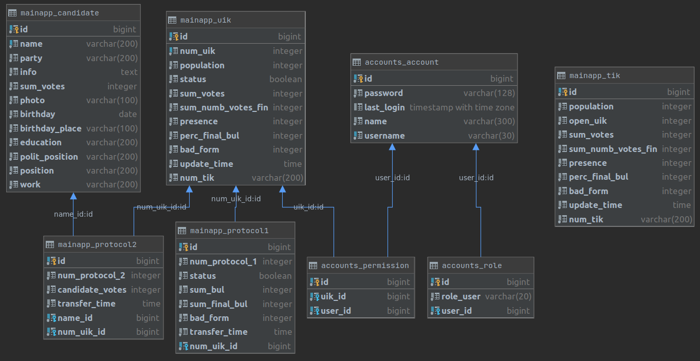

## Определение возможного диапазона нагрузок 
Согласно техническому заданию, пользователями в системе являются:
- УИК - 3628 пользователей
- ТИК - 128 пользователей
- МГИК - 1 пользователь

Итого `1 + 128 + 3628 = 3757` - одновременных пользователей.

Предположив, что пиковая нагрузка достигается, когда все УИК`и отправляют протоколы и происходит это в течении одной минуты, рассчитаем rps

`3757 / 60 = 62` rps - пиковая нагрузка при внесении данных.

Нагрузка при обычно просмотре страниц системы будет ниже, ее можно оценить, предположив, что каждый пользователь каждые пять минут обновляет страницу. На загрузку каждой страницы приходится в большинстве случаев один запрос.

`3757 / 60 / 5 = 12` rps - нагрузка при просмотре данных.

## Физическая схема базы данных

## Физическая система хранения
Исходя из модели предметной области, можно сделать наблюдения:
1) Новые записи добавляются только в таблицы mainapp_protocol1, mainapp_protocol2, mainapp_tik;
2) Внесение новых записей в таблицу mainapp_tik происходит после каждой конференции автоматически;
3) Данные в таблицах mainapp_uik, mainapp_candidate обновляются при получении новых протоколов;

Из этого и из схемы можно предположить, что для выполнения случайного запроса потребуется сделать выборку, в среднем, из 5 таблиц (запросы к таблицам accounts_* делаются на каждый запрос в целях проверки доступов).
Исходя из этого посчитаем средний qps:

`12 * 5 = 50` qps - средняя нагрузка на базу данных.
`62 * 5 = 310` qps - пиковая нагрузка на базу данных.

### Расчет нагрузки на базы данных:
#### 1
Большое количество связей, в том числе связи много-ко-многим, и то, что изменения данных практически не производится, подталкивает к использованию SQL базы данных. При таком запасе нет необходимости в шардировании, репликация не имеет большого смысла, так как большое количество запросов предполагает изменение данных. Поэтому выбор сделан в сторону **PostgreSQL**.
[Согласно бенчмаркам](https://habr.com/ru/company/drtariff/blog/383295/)  ssd-диски позволят добится 20 тыс. qps с одной машины, что дает многократный запас к qps, определенный в пункте "Физическая система хранения".
#### 2
Для хранения статических файлов, таких как фотографии кандидатов будет достаточно объема хранилища самого сервера, так как их количество и размер не значительны.

## Расчет нагрузки и потребного оборудования
### Расчет объема хранилища

### accounts_account - до `4 000` записей
| Поле          |  Память (байт)     |
| ------------- |------------------| 
|id |8 |
|username | ~30|
|password | ~128|
|name | ~300|
|last_login | 8|
|**Суммарно** | **474**|

### accounts_role - до `4 000` записей
| Поле          |  Память (байт)     |
| ------------- |------------------| 
|id |8 |
|role_user | ~20|
|user_id | 8|
|**Суммарно** | **36**|

### accounts_permission - до `10 000` записей
| Поле          |  Память (байт)     |
| ------------- |------------------| 
|id |8 |
|uik_id | 8|
|user_id | 8|
|**Суммарно** | **24**|

### mainapp_candidate - до `40` записей
| Поле          |  Память (байт)     |
| ------------- |------------------| 
|id |8 |
|name | ~200 |
|party | ~200|
|info | ~200|
|sum_votes | 4|
|photo | ~100|
|birthday | 8|
|birthday_place | ~100|
|education | ~200|
|polit_position | ~200|
|position | ~200|
|work | ~200|
|**Суммарно** | **1620**|

### mainapp_uik - до `4 000` записей
| Поле          |  Память (байт)     |
| ------------- |------------------| 
|id |8 |
|num_uik | 4 |
|population | 4|
|status | 1|
|sum_votes | 4|
|sum_numb_votes_fin | 4|
|presence | 4|
|perc_final_bul | 4|
|bad_form | 4|
|update_time | 8|
|num_tik | ~200|
|**Суммарно** | **245**|

### mainapp_tik - до `200` записей
| Поле          |  Память (байт)     |
| ------------- |------------------| 
|id | 8 |
|open_uik | 4 |
|population | 4|
|sum_votes | 4|
|sum_numb_votes_fin | 4|
|presence | 4|
|perc_final_bul | 4|
|bad_form | 4|
|update_time | 8|
|num_tik | ~200|
|**Суммарно** | **244**|

### mainapp_protocol1 - до `20 000` записей
| Поле          |  Память (байт)     |
| ------------- |------------------| 
|id | 8 |
|num_protocol_1 | 4 |
|status | 1|
|sum_bul | 4|
|sum_final_bul | 4|
|bad_form | 4|
|transfer_time | 8|
|num_uik_id | 8|
|**Суммарно** | **41**|

### mainapp_protocol2 - до `128 000` записей
| Поле          |  Память (байт)     |
| ------------- |------------------| 
|id | 8 |
|num_protocol_2 | 4 |
|candidate_votes | 4|
|transfer_time | 8|
|name_id | 8|
|num_uik_id | 8|
|**Суммарно** | **40**|

Итого полностью заполненная база данных будет занимать:

`4000*474 + 4000*36 + 10000*24 + 40*16200 + 4000*245 + 200*244 + 20000*41 + 128000*40 = 9896800 байт ~ 10` Мб.

Очевидно, что такой объем данных не представляет никакой серьезной нагрузки для хранилища.

### Расчет серверов
Ни пиковые нагрузки, ни размер БД не оказались значительными, поэтому с задачей обеспечения вычислительных мощностей справится один сервер. 
Бекэнд и фронтэнд сервера можно объединить так как трафик на серверах в пике не привышает 1 Гб/сек и не является бутылочным горлышком для системы.
В каждом сервере жесткие диски SSD.
Произведем расчет жестких дисков баз данных:

Так как значение iops ожидается невысоким, поэтому предлагается задействовать RAID6 включение носителей, так как он обеспечивает максимальную надежность данных, а потери в производительности для данной системы не играют большой роли. Для работы в сервере предлагается следующие носители.

Эффективный объем (Гб)| Объем на одном шарде | Диски| Модель| Стоимость (руб./шт.)
---|---|---|---|---
4096|400| 5 дисков по 200 Гб в RAID6|[400-AWHC]| 11 000

[400-AWHC]: https://www.onlinetrade.ru/catalogue/servernye_zhestkie_diski_i_ssd-c4239/dell/nakopitel_ssd_dell_2.5_1x240gb_sata_hot_swapp_400_awhc-2014001.html
## Выбор хостинга и расположения серверов
Для хостинга выбрано cloud.croc.ru. Расположение серверов ограничено расположением датацентров крока в России - только Москва.
## Обеспечение отказоустойчивости
Для обеспечения отказоустойчивости серверу БД следует иметь master-slave репликацию, 1 слэйв на мастер. Так же стоит задействовать бесперебойный источник питания.

## Расчет стоимости
Крок предоставляет возможность располагать в датацентре сервера, поэтому расчет будет вестись не стоимости виртуальных машин, а реальных серверов.
#### Сервера
Стоимость дисков перечислена [выше](#disk). В итоге общая стоимость дисков выйдет в `60 000` руб.

Стоимость бесперебойного источника питания [Dell EMC SmartUPS 1000W] составляет `56 000` руб.

[Dell EMC SmartUPS 1000W]: https://www.dell.com/en-us/work/shop/servers-storage-and-networking/poweredge-r6515-rack-server/spd/poweredge-r6515/pe_r6515_13732a_vi_vp

Рассчитаем стоимость серверов:
Выбрана платформа [PowerEdge R6515]. Конкретные цены получены после конфигурации по ссылке.

Cores|RAM (ГБ.)|Стоимость (руб./шт.) | кол-во (шт.)
---|---|---|---
4|8| 70 000 | 2

[PowerEdge R6515]: https://www.dell.com/en-us/work/shop/servers-storage-and-networking/poweredge-r6515-rack-server/spd/poweredge-r6515/pe_r6515_13732a_vi_vp

Итого, общая стоимость оборудования составит `256` т. руб.

## Расчет прироста системы
Так как объем базы данных незначителен, количество ТИК\`ов и УИК\`ов значительно изменяться не будет, можно утверждать, что данное оборудование обновлять не придется
